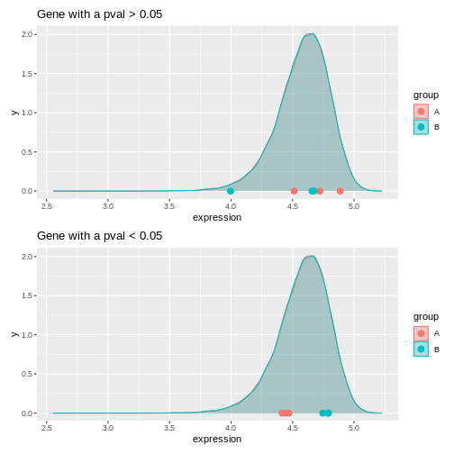
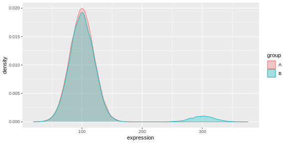
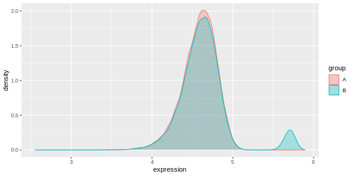

:::::::::::::::::::::::::::::::::::::: questions

- What are linear models?

- What is a FDR?

::::::::::::::::::::::::::::::::::::::::::::::::

::::::::::::::::::::::::::::::::::::: objectives

- Explore linear models and learn how to interpret coefficients

- Address the multiple testing issue

::::::::::::::::::::::::::::::::::::::::::::::::


*Parts of this chapter are based on the courses [WSBIM1322](https://uclouvain-cbio.github.io/WSBIM1322/)* 
*and [Omics data analysis](https://uclouvain-cbio.github.io/WSBIM2122/).*


# Multifactorial design and linear models

The outcome of an experiment, such as a gene expression level in the case of an RNA-seq, can 
be seen as the sum of several factors:

-	the treatments effects (these are the effects you actually want to study)

-	biological effects (representing natural biological differences between samples that you might also have to consider)

-	technical effects (that come from the experimental process itself and that could potentially influence the measurements)

-	and lastly, outcome will also reflect an error, which represent the random variability (or experiment noise) that cannot be explain be any of the known factors. 


(figure from [Lazic (2017)](https://www.amazon.com/Experimental-Design-Laboratory-Biologists-Reproducibility/dp/1107424887)).

## Single-factor design

Let's start by a simple design, and let's say we have the gene expression values 
of 3 control samples and 3 samples treated with a drug, assuming that there is 
no other biological effect or batch effect to consider. 

We can use the following linear model to modelise the expression values:

$$y = \beta_0 + \beta_1 . x$$

In this equation, 

- $y$ would be the measured expression level of a gene

- the design factor $x$ is a binary indicator variable representing the two 
groups of our experiment. It will take the value of 0 if we are considering the 
control samples, and a value of 1 when considering treated samples.

**When considering a control sample**, the $x$ factor is set to 0.

The $\beta_1 . x$ term is hence equal to 0, so the equation can be written:

$$y = \beta_0$$

This means that the $\beta_0$ term represents the expression level of the gene 
in the control samples, this coefficient is usually called the **intercept**

**When considering a treated sample**, the $x$ factor is set to 1. 

The equation becomes:

$$y = \beta_0 + \beta_1$$

Assuming our expression values are in a log scale then

$$\beta_1 = y - \beta_0 = log(expression_{Treated\_cells}) - log(expression_{Control\_cells})$$

$$\beta_1 = log(\frac{expression_{Treated\_cells}}{expression_{Control\_cells}})$$

The $\beta_1$ term represents hence the **logFoldchange** between the treated 
and the control samples (the treatment effect).

**The goal is now to estimate the coefficients and test their significance**

The $\beta_0$ and $\beta_1$ coefficients can be estimated from the data using
the expression values in the control and in the treated samples. 

A statistical test can then be applied, to test if the $\beta_1$ coefficient 
(the logFC due to the treatment effect) is significantly different from 0. 

The null hypothesis is that there is no difference across the sample groups, 
which is the same as saying that the $\beta_1$ = 0. 

- $H_0$: $\beta_1 = 0$    (the logFC = 0)
- $H_1$: $\beta_1 \neq 0$  (the logFC \neq 0)


### Example

We are going to use as a toy example a subsetted version of the rna dataset.
Let's focus only on the first gene, the gene *Asl*, and let's subset the table to keep only 
female mice at time 0 and 8.


``` r
rna <- read_csv("data/rnaseq.csv")
```

``` output
Rows: 32428 Columns: 19
── Column specification ────────────────────────────────────────────────────────
Delimiter: ","
chr (14): gene, sample, organism, sex, infection, strain, tissue, product, e...
dbl  (5): expression, age, time, mouse, ENTREZID

ℹ Use `spec()` to retrieve the full column specification for this data.
ℹ Specify the column types or set `show_col_types = FALSE` to quiet this message.
```

``` r
rna1 <- rna %>% 
  filter(gene %in% c("Asl"), time %in% c(0,8), sex == "Female") %>% 
  mutate(expression_log = log(expression)) %>% 
  select(gene, sample, expression_log, time, infection, sex) %>% 
  arrange(gene, infection) 
```

Let's also convert the `infection` column into a factor, in order to set the `NonInfected` 
condition as the reference level. 


``` r
rna1$infection <- factor(rna1$infection, levels = c("NonInfected", "InfluenzaA"))
```


Assuming the expression values follow a normal distribution (even though, 
as we’ll see later, this isn’t actually true!) and let's use the `lm()` function 
to fit a linear model to compare infected mice to non-infected mice.


``` r
mod1 <- lm(expression_log ~ infection, data = rna1)
mod1
```

``` output

Call:
lm(formula = expression_log ~ infection, data = rna1)

Coefficients:
        (Intercept)  infectionInfluenzaA  
             6.0941               0.8358  
```

The lm() function has estimated the coefficients of the linear model:

- The estimate for the $\beta_0$ coefficient (the `Intercept`) is 6.0941

- The estimate for the $\beta_1$ coefficient (annotated as the `infectionInfluenzaA` coefficient) 
is 0.8358

We can visualise this linear model with:


``` r
rna1 %>% 
  ggplot(aes(x = infection, y = expression_log)) +
  geom_jitter() +
  geom_boxplot(alpha = 0) +
  geom_point(aes(x = "NonInfected", y = 6.094074), color = "blue", size = 4) +
  geom_point(aes(x = "InfluenzaA", y = 6.094074 + 0.8357904), color = "red", size = 4)
```


And indeed, we see that

-- the intercept (the $\beta_0$ coefficient) corresponds to the mean expression 
level of the gene in the `Noninfected` group corresponds (the blue dot)

-- the sum of the  $\beta_0$ and the $\beta_1$ coefficients (the intercept + the logFC)
corresponds to the mean expression level of the gene in the `InfluenzaA` group
(the red dot)


We can also extract the p-value associated with the `infectionInfluenzaA` coefficient:
  


``` r
summary(mod1)
```

``` output

Call:
lm(formula = expression_log ~ infection, data = rna1)

Residuals:
     Min       1Q   Median       3Q      Max 
-0.20520 -0.12727  0.01064  0.13955  0.19934 

Coefficients:
                    Estimate Std. Error t value Pr(>|t|)    
(Intercept)          6.09407    0.08991  67.782 6.94e-10 ***
infectionInfluenzaA  0.83579    0.12715   6.573 0.000594 ***
---
Signif. codes:  0 '***' 0.001 '**' 0.01 '*' 0.05 '.' 0.1 ' ' 1

Residual standard error: 0.1798 on 6 degrees of freedom
Multiple R-squared:  0.8781,	Adjusted R-squared:  0.8578 
F-statistic: 43.21 on 1 and 6 DF,  p-value: 0.0005944
```


We can see that the coefficient `infectionInfluenzaA` is highly significant.


## Two-factor design

Let's consider a slightly more complex design. We now have the gene 
expression values of 6 control and 6 treated samples, but the experiment was 
conducted in 2 different cell types (cells A and cells B). We hence have 3 controls 
and 3 treated samples for each cell type. 


To take into account the treatment effect while controlling the cell origin, 
we can use the following linear model:

$$y = \beta_0 + \beta_1 . x_1 + \beta_2 . x_2$$

We could rewrite this equation as:

$$y = \beta_0 + Treatment. x_1 + Cell . x_2$$


In this equation, 

- the $\beta_0$ term represents the `intercept`, i.e, the **expression level of the gene 
in the reference sample**, for instance the untreated cell type A.

- the design factor $x_1$ is a binary indicator variable representing the two 
treatment conditions of our experiment. It will take the value of 0 if we are 
considering the untreated samples, and a value of 1 when considering treated samples.

- The `Treatment` term represents the **logFoldchange due to treatment**.

- the design factor $x_2$ is another binary indicator variable representing the two 
cell types of our experiment. It will take the value of 0 if we are considering 
the cell type A, and a value of 1 when considering cell type B.

- The `Cell` term represents the **logFoldchange due to celltype**.

The following figure (generated with the `ExploreModelMatrix` package) illustrates 
the value of the linear predictor of a linear model for each combination 
of input variables. 


``` output
[[1]]
```


From this figure, we can see how the genes log expression values are modelised
in the different samples:

- In `untreated cells A`: &nbsp;&nbsp;&nbsp;&nbsp;&nbsp;&nbsp;&nbsp;&nbsp;&nbsp;$y$ = $\beta_0$ 

- In `treated cells A`: &nbsp;&nbsp;&nbsp;&nbsp;&nbsp;&nbsp;&nbsp;&nbsp;&nbsp;&nbsp;&nbsp;&nbsp;&nbsp;$y$ = $\beta_0$ + *Treatment*

- In `untreated cells B`: &nbsp;&nbsp;&nbsp;&nbsp;&nbsp;&nbsp;&nbsp;&nbsp;&nbsp;$y$ = $\beta_0$ + *Cell*

- In `treated cells B`: &nbsp;&nbsp;&nbsp;&nbsp;&nbsp;&nbsp;&nbsp;&nbsp;&nbsp;&nbsp;&nbsp;&nbsp;&nbsp;$y$ = $\beta_0$ + *Treatment* + *Cell*


::::::::::::::::::::::::::::::::::::: challenge

### Challenge: 

Subset the rna dataset as below to keep only on the gene *Ddx3x*, and mice at time 0 and 8.


``` r
rna2 <- rna %>% 
  filter(gene %in% c("Ddx3x"), time %in% c(0,8)) %>% 
  mutate(expression_log = log(expression)) %>% 
  select(gene, sample, expression_log, time, infection, sex) %>% 
  arrange(gene, infection) 

#set the `NonInfected` condition as the reference level. 
rna2$infection <- factor(rna2$infection, levels = c("NonInfected", "InfluenzaA"))
```


Use the `lm()` function to fit a linear model that would account for infection and sex.

Interprete the results.

:::::::::::::::::::::::: solution


``` r
mod2 <- lm(expression_log ~ infection + sex, data = rna2)
summary(mod2)
```

``` output

Call:
lm(formula = expression_log ~ infection + sex, data = rna2)

Residuals:
      Min        1Q    Median        3Q       Max 
-0.163831 -0.019300  0.005398  0.030459  0.076010 

Coefficients:
                    Estimate Std. Error t value Pr(>|t|)    
(Intercept)         10.06641    0.02789 360.888  < 2e-16 ***
infectionInfluenzaA  0.15182    0.03364   4.513 0.000882 ***
sexMale             -0.28277    0.03399  -8.319 4.49e-06 ***
---
Signif. codes:  0 '***' 0.001 '**' 0.01 '*' 0.05 '.' 0.1 ' ' 1

Residual standard error: 0.06294 on 11 degrees of freedom
Multiple R-squared:  0.8906,	Adjusted R-squared:  0.8707 
F-statistic: 44.79 on 2 and 11 DF,  p-value: 5.175e-06
```

The coefficients `infectionInfluenzaA` (representing the *Infection Effect*) and
the coefficient `sexMale`, representing the *Sex Effect*, are both significant.


``` r
rna2 %>% 
  ggplot(aes(x = infection, y = expression_log)) +
  geom_jitter(size = 3, aes(color = sex)) +
  geom_boxplot(alpha = 0) +
  facet_wrap(~ sex)+
  theme(legend.position = "bottom")
```


:::::::::::::::::::::::::::::::::
::::::::::::::::::::::::::::::::::::::::::::::::

::::::::::::::::::::::::::::::::::::: challenge

### Challenge: 

Re-use the `lm()` function to fit a linear model that would only account for infection.

Compare with the previous model and try to interprete the difference.

:::::::::::::::::::::::: solution


``` r
mod3 <- lm(expression_log ~ infection, data = rna2)
summary(mod3)
```

``` output

Call:
lm(formula = expression_log ~ infection, data = rna2)

Residuals:
     Min       1Q   Median       3Q      Max 
-0.20156 -0.15940  0.02542  0.14115  0.19720 

Coefficients:
                    Estimate Std. Error t value Pr(>|t|)    
(Intercept)          9.94523    0.06150 161.710   <2e-16 ***
infectionInfluenzaA  0.15182    0.08697   1.746    0.106    
---
Signif. codes:  0 '***' 0.001 '**' 0.01 '*' 0.05 '.' 0.1 ' ' 1

Residual standard error: 0.1627 on 12 degrees of freedom
Multiple R-squared:  0.2025,	Adjusted R-squared:  0.136 
F-statistic: 3.047 on 1 and 12 DF,  p-value: 0.1064
```

The  *Infection Effect* is not significant anymore.


``` r
rna2 %>% 
  ggplot(aes(x = infection, y = expression_log)) +
  geom_jitter(size = 3, aes(color = sex)) +
  geom_boxplot(alpha = 0) +
  theme(legend.position = "bottom")
```


:::::::::::::::::::::::::::::::::
::::::::::::::::::::::::::::::::::::::::::::::::

## Design with interaction

Coming back to the previous experimental design were we considered 3 controls 
and 3 treated samples for each cell type (cells A and cells B). 
An interaction term could be added to the linear model, to modelise a 
treatment effect that would differ across the cell types.

The linear model could be written 

$$y = \beta_0 + \beta_1 . x_1 + \beta_2 . x_2 + \beta_{12}.x_1.x_2.$$

We could rewrite this equation as:

$$y = \beta_0 + Treatment. x_1 + Cell . x_2 + Treatment.Cell.x_1.x_2$$


In this equation, 

- the $\beta_0$ term represents the `intercept`, i.e, the **expression level of the gene 
in the reference sample**, for instance the untreated cell type A.

- the design factor $x_1$ will take the value of 0 if we are 
considering the untreated samples, and a value of 1 when considering treated samples.

- The `Treatment` term represents the **treatment effect in the reference cell type**.
In this case it would represent the logFoldchange between treated and untreated celltype A.

- the design factor $x_2$  will take the value of 0 if we are considering 
the cell type A, and a value of 1 when considering cell type B.

- The `Cell` term represents the **Celltype effect in the untreated cells**.
In this case it would represent the logFoldchange between untreated celltype A and untreated celltype A.

- The `Treatment.Cell` term represents the **treatment effect that would be different in cell type B compared to cell type A**. This term will only be considered in the equation when we are referring to 
treated celltype B (i.e. when $x_1$ = 1 and $x_2$ = 1)

The following figure (generated with the `ExploreModelMatrix` package) illustrates 
the value of the linear predictor of a linear model for each combination 
of input variables. 


``` output
[[1]]
```


From this figure, we can see how the genes log expression values are modelised
in the different samples:

- In `untreated cells A`: &nbsp;&nbsp;&nbsp;&nbsp;&nbsp;&nbsp;&nbsp;&nbsp;&nbsp;$y$ = $\beta_0$ 

- In `treated cells A`: &nbsp;&nbsp;&nbsp;&nbsp;&nbsp;&nbsp;&nbsp;&nbsp;&nbsp;&nbsp;&nbsp;&nbsp;&nbsp;$y$ = $\beta_0$ + *Treatment*

- In `untreated cells B`: &nbsp;&nbsp;&nbsp;&nbsp;&nbsp;&nbsp;&nbsp;&nbsp;&nbsp;$y$ = $\beta_0$ + *Cell*

- In `treated cells B`: &nbsp;&nbsp;&nbsp;&nbsp;&nbsp;&nbsp;&nbsp;&nbsp;&nbsp;&nbsp;&nbsp;&nbsp;&nbsp;$y$ = $\beta_0$ + *Treatment* + *Cell* + *Treatment.Cell* 


::::::::::::::::::::::::::::::::::::: challenge

### Challenge: 

Subset the rna dataset as below to keep only on the gene *Ddx3x*, and mice at time 0 and 8.


Re-use the previous `rna2` dataset and fit a linear model with an interaction between 
infection and sex.

Interprete the results.

:::::::::::::::::::::::: solution


``` r
mod3 <- lm(expression_log ~ infection * sex, data = rna2)
summary(mod3)
```

``` output

Call:
lm(formula = expression_log ~ infection * sex, data = rna2)

Residuals:
      Min        1Q    Median        3Q       Max 
-0.155912 -0.025986  0.005398  0.032198  0.083929 

Coefficients:
                            Estimate Std. Error t value Pr(>|t|)    
(Intercept)                 10.07433    0.03256 309.431  < 2e-16 ***
infectionInfluenzaA          0.13598    0.04604   2.953 0.014451 *  
sexMale                     -0.30125    0.04973  -6.057 0.000122 ***
infectionInfluenzaA:sexMale  0.03696    0.07033   0.525 0.610714    
---
Signif. codes:  0 '***' 0.001 '**' 0.01 '*' 0.05 '.' 0.1 ' ' 1

Residual standard error: 0.06512 on 10 degrees of freedom
Multiple R-squared:  0.8936,	Adjusted R-squared:  0.8616 
F-statistic: 27.99 on 3 and 10 DF,  p-value: 3.529e-05
```

The coefficients `infectionInfluenzaA` (representing the *Infection Effect*) and
the coefficient `sexMale`, representing the *Sex Effect*, are both significant.

But the interaction term is not. This indicates that the *Infection Effect* is not
significantly different between males and females

:::::::::::::::::::::::::::::::::
::::::::::::::::::::::::::::::::::::::::::::::::


# Multiple testing issue

In the few examples of linear model that we have seen in the previous section, 
the `lm()` function was always applied to a single gene. In a real RNA-seq experiment, 
we will have a few thousand tests to perform, as each gene is going to be tested.

Let's use the following dataset that provides log expression values for 20,000 genes
in 6 samples, three in groupA and three in groupB.


``` r
if (!file.exists("data/exp.rda")) {
    dir.create("data", showWarnings = FALSE)
    download.file(
        url = "https://github.com/UCLouvain-BIOINFO/bioc-rnaseq/tree/main/episodes/data/exp.rda?raw=true", 
        destfile = "data/exp.rda"
    )
}
load("data/exp.rda")
exp
```

``` output
# A tibble: 20,000 × 7
   Gene      A1    A2    A3    B1    B2    B3
   <chr>  <dbl> <dbl> <dbl> <dbl> <dbl> <dbl>
 1 Gene1   4.72  4.89  4.51  4.00  4.66  4.67
 2 Gene2   4.61  4.96  4.58  4.53  4.21  4.78
 3 Gene3   4.75  4.70  4.75  4.55  4.89  4.31
 4 Gene4   4.83  4.83  4.43  4.53  4.38  4.55
 5 Gene5   4.68  4.33  4.84  4.58  4.64  4.92
 6 Gene6   4.57  4.74  4.68  4.84  4.42  4.96
 7 Gene7   4.68  4.47  4.50  4.55  4.23  4.67
 8 Gene8   4.59  4.81  4.44  4.45  4.20  4.61
 9 Gene9   4.53  4.84  4.51  4.53  4.61  4.59
10 Gene10  4.74  4.09  4.61  4.33  4.72  4.61
# ℹ 19,990 more rows
```


Let's apply a t.test on one of these genes 


``` r
n <- 57
t.test(exp[n, c("A1", "A2", "A3")], exp[n, c("B1", "B2", "B3")])
```

``` output

	Welch Two Sample t-test

data:  exp[n, c("A1", "A2", "A3")] and exp[n, c("B1", "B2", "B3")]
t = 0.51756, df = 2.3508, p-value = 0.6494
alternative hypothesis: true difference in means is not equal to 0
95 percent confidence interval:
 -0.849086  1.121633
sample estimates:
mean of x mean of y 
 4.575339  4.439066 
```

Now, let's apply the t.test on all genes


``` r
res <- exp %>% 
  rowwise() %>% 
  mutate(pval = t.test(c(A1, A2, A3), c(B1,B2,B3))$p.value) %>% 
  ungroup() # to revert the rowwise()
res
```

``` output
# A tibble: 20,000 × 8
   Gene      A1    A2    A3    B1    B2    B3  pval
   <chr>  <dbl> <dbl> <dbl> <dbl> <dbl> <dbl> <dbl>
 1 Gene1   4.72  4.89  4.51  4.00  4.66  4.67 0.367
 2 Gene2   4.61  4.96  4.58  4.53  4.21  4.78 0.362
 3 Gene3   4.75  4.70  4.75  4.55  4.89  4.31 0.474
 4 Gene4   4.83  4.83  4.43  4.53  4.38  4.55 0.249
 5 Gene5   4.68  4.33  4.84  4.58  4.64  4.92 0.632
 6 Gene6   4.57  4.74  4.68  4.84  4.42  4.96 0.679
 7 Gene7   4.68  4.47  4.50  4.55  4.23  4.67 0.682
 8 Gene8   4.59  4.81  4.44  4.45  4.20  4.61 0.286
 9 Gene9   4.53  4.84  4.51  4.53  4.61  4.59 0.689
10 Gene10  4.74  4.09  4.61  4.33  4.72  4.61 0.773
# ℹ 19,990 more rows
```


:::::::::::::::::::::::::::::::::::::::  challenge

## Challenge:  

- How many significant genes did we obtained ? Which genes are of possible
biological interest?

::::::::::::::::::::::::::::::::::::::::::::::::::

The data above have been generated with the rnorm function for all samples.

This is the code that generated the data:


``` r
set.seed(2025)
exp <- matrix(rnorm(20000*6, mean = 100, sd = 20), ncol = 6)
rownames(exp) <- paste0("Gene", 1:20000)
colnames(exp) <- c(paste0("A", 1:3), paste0("B", 1:3))
exp <- log(exp)
exp <- as_tibble(exp, rownames = "Gene") 
```

:::::::::::::::::::::::::::::::::::::::  challenge

## Challenge:  

- Do you still think any of the features show significant differences?

- Why do we obtain genes with a p-value < 0.05?


:::::::::::::::::::::::: solution


``` r
table(res$pval < 0.05)
```

``` output

FALSE  TRUE 
19324   676 
```

``` r
sign_genes <- res %>% filter(pval < 0.05) 
unsign_genes <- res %>% filter(pval > 0.05) 

res_long <- res %>% 
  pivot_longer(names_to = "sample", values_to = "expression", -c(Gene, pval)) %>% 
  mutate(group = substr(sample, 1, 1)) 

fig1 <- res_long %>% 
  ggplot(aes(x = expression, fill = group, color = group)) +
  geom_density(alpha = .3) +
  geom_point(data = res_long %>% filter(Gene == unsign_genes$Gene[1]),
             aes(x = expression, y = 0, color = group), size = 3) +
  ggtitle("Gene with a pval > 0.05")


fig2 <- res_long %>% 
  ggplot(aes(x = expression, fill = group, color = group)) +
  geom_density(alpha = .3) +
  geom_point(data = res_long %>% filter(Gene == sign_genes$Gene[1]),
             aes(x = expression, y = 0, color = group), size = 3) +
  ggtitle("Gene with a pval < 0.05")

fig1 / fig2
```



:::::::::::::::::::::::::::::::::

::::::::::::::::::::::::::::::::::::::::::::::::::


:::::::::::::::::::::::::::::::::::::::  challenge

## Challenge: Discuss 

- If you were to visualize the p-value distribution using a histogram, how would you expect it to look like?

:::::::::::::::::::::::: solution


``` r
res %>% 
  ggplot(aes(x = pval)) + 
  geom_histogram(binwidth = 0.05, boundary = 0, color = "gray")
```




:::::::::::::::::::::::::::::::::

::::::::::::::::::::::::::::::::::::::::::::::::::


[This xkcd cartoon](https://xkcd.com/882/) humorously illustrates the multiple 
testing issue by depicting scientists testing whether eating jelly beans causes acne.


<div class="figure" style="text-align: center">

<p class="caption">Do jelly beans cause acne? Scientists investigate. From [xkcd](https://xkcd.com/882/).</p>
</div>


Now, let's slightly modify our simulated expression data.

In a typical RNA-seq experiment, we may test around 20,000 genes, but only a 
fraction of them are usually truly differentially expressed. We could imagine 
a drug treatment that would modify the expression of about 1000 genes, but that 
would have no impact on the other ones. 

To mimic this, we are going to simulate an up-regulation for the first 1,000 genes 
by increasing their expression values in group B.


``` r
exp_modified <- exp

exp_modified[1:1000, c("B1", "B2", "B3")] <- log(matrix(rnorm(1000*3, mean = 300, sd = 20), ncol = 3))

exp_modified <- exp_modified %>% 
  mutate(DE = c(rep(TRUE, 1000), rep(FALSE, 19000)))

exp_modified %>% 
  pivot_longer(names_to = "sample", values_to = "expression", -c(Gene, DE)) %>% 
  mutate(group = substr(sample, 1, 1)) %>% 
  ggplot(aes(x = expression, fill = group, color = group)) + 
  geom_density(alpha = .3)
```



Let's run a t-test on this new dataset:


``` r
res_modified <- exp_modified %>% 
  rowwise() %>% 
  mutate(pval = t.test(c(A1, A2, A3), c(B1, B2, B3), var = TRUE)$p.value) %>% 
  ungroup()
table(res_modified$pval < 0.05)
```

``` output

FALSE  TRUE 
18115  1885 
```

:::::::::::::::::::::::::::::::::::::::  challenge

## Challenge: Discuss 

- How do think the histogram of the p-values of the first 1000 would look like?

- What about the histogram of all p-values?

:::::::::::::::::::::::: solution


``` r
h1 <- res_modified %>% filter(DE) %>% 
  ggplot(aes(x = pval)) + 
  geom_histogram(binwidth = 0.05, boundary = 0) +
  xlim(0, 1) +
  ylim(0, 1500) +
  ggtitle("Ho is FALSE")+
  theme_bw() +
  theme(aspect.ratio = 1,
        panel.grid = element_blank()) 

h2 <- res_modified %>% filter(!DE) %>% 
  ggplot(aes(x = pval)) + 
  geom_histogram(binwidth = 0.05, boundary = 0) +
  xlim(0, 1) +
  ylim(0, 1500) +
  ggtitle("Ho is TRUE") +
  theme_bw() +
  theme(aspect.ratio = 1,
        panel.grid = element_blank()) 

h3 <- res_modified %>% 
  ggplot(aes(x = pval)) + 
  geom_histogram(binwidth = 0.05, boundary = 0) +
  geom_hline(yintercept = 950, color = "red", lwd = 2) +
  ggtitle("All genes") +
  theme_bw() +
  theme(aspect.ratio = 1,
        panel.grid = element_blank()) 

h1 + h2 + h3
```


The figure on the right illustrates the principle behind the FDR adjustment. 
The False discovery rate (FDR) is the expected proportion of false positives 
among all the results considered as "significant" (i.e. pval < 0.05).
The adjustment procedure estimate the proportion of hypothesis that are null 
and then adjust the p-values accordingly.

:::::::::::::::::::::::::::::::::

::::::::::::::::::::::::::::::::::::::::::::::::::

### Adjustment for multiple testing

The False discovery rate (FDR) computes the expected fraction of false 
positives among all discoveries. It allows us to choose n results with a given FDR.
Widely used examples are Benjamini-Hochberg or q-values.

let's use the `p.adjust()` function to adjust the pvalues.


``` r
res_modified <- res_modified %>% 
  mutate(padj = p.adjust(pval, method = "BH")) 

table(sign_padj = res_modified$padj < 0.05, sign_pval = res_modified$pval < 0.05)
```

``` output
         sign_pval
sign_padj FALSE  TRUE
    FALSE 18115  1056
    TRUE      0   829
```

Only 829 were found to be significant after FDR correction.


:::::::::::::::::::::::::::::::::::::::  challenge

## Challenge: 

- How many genes would you expect to remain significant after FDR correction in the first dataset?


:::::::::::::::::::::::: solution


``` r
res <- res %>% 
  mutate(padj = p.adjust(pval, method = "BH"))
table(res$pval < 0.05)
```

``` output

FALSE  TRUE 
19324   676 
```

``` r
table(res$padj < 0.05)
```

``` output

FALSE 
20000 
```


:::::::::::::::::::::::::::::::::


::::::::::::::::::::::::::::::::::::::::::::::::::
